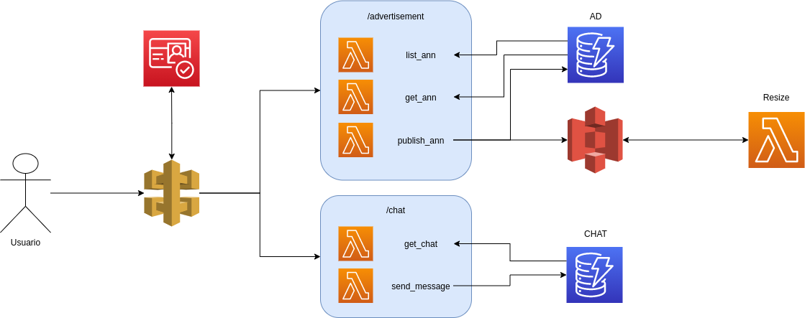
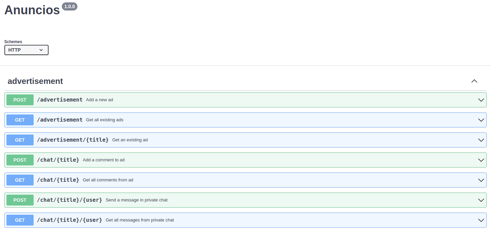

# Arquitectura

# Endpoints

Se puede observar el body de las peticiones y las respuestas esperadas pegando el contenido del fichero `swagger.yaml` en la [web de swagger editor](https://editor.swagger.io).
# Descripción general y elección de componentes
Esta arquitectura es muy habitual para el consumo de recursos a traves de una API en cloud, se apoya en un elemento de autenticación para acceder a una API a traves de la cual se consumen los datos de la aplicación. Es escalable y minimiza el coste de recursos.

A continuación se describen los diferentes elementos.

## Almacenamiento
### Base de datos
Se ha elegido DynamoDB debido al tipo de consultas que es espera de este servicio, siempre se realizan peticiones sobre un anuncio, ya sea para publicar, obtener detalles, comentar o tener una conversación privada con el vendedor, por lo que una base de datos clave-valor permite un volumen de transacciones muy elevado sobre todo para el caso de uso del chat sin complicar la lógica de acceso a los datos.

Este servicio de AWS además es serverless por lo que minimiza el mantenimiento y permite la escalabilidad.
### Almacenamiento
Se ha optado por S3 para almacenar las imagenes de los anuncios, esto tiene tres motivos fundamentales:
 * El acceso a los ficheros se puede hacer mediante url, por lo que minimiza los problemas de fricción si se implementase una web para consumirlas.
 * La generación de eventos de escritura facilita el tratamiento de las imagenes originales, permitiendo que el requisito de reescalado de imagenes se simplifique.
 * Es un servicio serverless que garantiza la disponibilidad del dato y la escalabilidad de la aplicación sin requerir mantenimiento adicional.

 ### API
 En este caso se ha optado por API Gateway para el consumo de esta aplicación. Este servicio administrado minimiza el coste humano del mantenimiento y permitiendo la escalabilidad.
 Todas las peticiones Post enviadas a la API validan el cuerpo del mensaje con jsonschema.

 ### Cognito
 Este servicio de AWS nos aporta la autenticación y autorización de usuarios de forma escalable y sin necesidad de un desarrollo propio.

 En este caso se ha optado por una inserción manual de usuarios debido a la falta de frontal web para el flujo de autenticación, no obstante esto podría hacerse sin requerir intervención manual para la creación de usuarios, dejando que ellos se registren y creando una interfaz de login.

# Utilidades para probar la aplicación
## Obtención de tokens de usuarios
Una vez creados los usuarios de Cognito se debe usar el script `get_token.sh` para obtener los tokens y poder llamar a la API, en mi caso he usado tres usuarios user01@mail.com, user02@mail.com y user03@mail.com

`bash get_token.sh <pool_id> <client_id> <user_mail> <user_pwd>`
## Llamadas a la API
Para probar la API se adjunta una colección de requests de la herramienta Postman, en la colección se encuentran 4 variables que son necesarias y facilitan el uso, esta son `API Endpoint` que contiene la url completa de la API, como por ejemplo `https://9vjn7b1uvj.execute-api.eu-west-1.amazonaws.com/demo`, tambien las variables `Token01`, `Token02` y `Token03` que contienen tokens de tres usuarios diferentes para hacer toda la prueba, esta consiste en:
* ADs:
  * Publish:(Token01) Crea un anuncio llamado `Foto Hoja`.
  * Get ADs: Devuelve todos los anuncios registrados.
  * Get AD: Devuelve la descripción del anuncio `Foto Hoja`.

* Chats:
  * Comment AD:(Token01) Crea un comentario en el anuncio `Foto Hoja`.
  * Get Comments AD: Devuelve los comentarios del anuncio `Foto Hoja`.
  * Chat AD Priv:(Token02) Envia un mensaje privado al propietario del anuncio `Foto Hoja`.
  * Chat AD Priv external:(Token03) Envia un mensaje privado al propietario del anuncio `Foto Hoja`, como el anuncio es del (Token01) y el chat es con el (Token02) devuelve un error 403.
  * Get Chat AD Priv: (Token01) Recibe todos los mensajes del chat privado con (Token02).

# Evaluación personal
A continuación se enumeran los puntos a tener en cuenta en el enunciado y se argumenta si se han resuelto, en caso de no resolverse se puede plantear una posible solución.

Aunque se hace referencia a una página web en este caso la implementación se limita a la API.
## Mínimo
* <ins>Página que liste todos los anuncios registrados en base de datos</ins>: La API devuelve esta información en el endpoint `/advertisement` usando una llamada get.
* <ins>Página que permita ver los detalles de un anuncio</ins>: La API devuelve esta información en el endpoint `/advertisement/{title}` usando una llamada get.
* <ins>Página que permita publicar un nuevo anuncio de texto</ins>: La API permite publicar un anuncio en el endpoint `/advertisement` usando una llamada post.
* <ins>Chat / comentarios asociados a cada anuncio</ins>: La API permite publicar un comentario en el endpoint `/chat/{title}` usando una llamada post y obtener esta información en el mismo endpoint usando una llamada get.
* <ins>Foco en minimizar costes operativos</ins>: Esta aplicación puede tener coste 0 en la capa gratuita de AWS mientras se mantenga en reposo, escala sin necesidad de intervención humana gracias a servicios serverless y permite un despliegue sencillo que reduce el coste del despliegue haciendo uso de serverless framework.
* <ins>Se valorará especialmente el uso de tecnologías serverless</ins>: Los servicios usados en la aplicación son administrados y la mayoría serverless.
## Opcionales
* <ins>Caducidad automática de los anuncios tras un cierto periodo de tiempo</ins>: Los anuncios tienen un periodo de caducidad definido en la variable `threshold`, esta variable se usa para definir una política de expiración del bucket que eliminará las iamgenes junto con una función lambda `cleaner` que borrará de la base de datos los anuncios que superen ese tiempo.
* <ins>Control de accesos mediante usuarios</ins>: Se hace uso de cognito para autenticar y autorizar a los usuarios, que no podrán acceder a chat privados de otros usuarios y que quedarán registrados en los comentarios y las publicaciones propias.
* <ins>Chats privados comprador-vendedor o comprador-vendedor-anuncio</ins>: Se ha optado por la versión comprador-vendedor-anuncio de forma que en el endpoint `/chat/{title}/{user}` se puede mantener un chat entre el propietario del anuncio `{title}` y el usuario `{user}`.
* <ins>Subir al menos una imagen junto al texto del anuncio</ins>: Se requiere una imagen formateada como string en base64 para la publicación de anuncios, esta se almacena en S3 y queda registrada la URL en la descripción del anuncio.
* <ins>Re-escalado de imágenes a una resolución fija</ins>: Una vez llega una imagen a s3 bajo el prefijo `advertisements/image_raw` se dispara la función lambda `resize` que la escala a 50x50 y la almacena en una ruta de diferente prefijo añadiendo esa ruta a la tabla de detalles del anuncio.
* <ins>Refresco automático de la interfaz en caso de actualización de la información en
backend</ins>: **No esta implementada** debido a que no se tiene un frontal web, no obstante una solución es mantener a la web haciendo pooling de manera que las actualizaciones del backend sean notificadas como se propone por ejemplo en [este post](https://medium.com/serverless-transformation/asynchronous-client-interaction-in-aws-serverless-polling-websocket-server-sent-events-or-acf10167cc67).
* <ins>Buscador de anuncios</ins>: En el endpoint de `/advertisement` con la llamada get si se le pasa un parámetro `prefix` via query parameter, se realiza la query de dynamo con una key_condition de `BEGINS_WITH` en lugar de un scan, esta consulta falla por algún motivo que no consigo solucionar.
* <ins>One-click deployment</ins>: Se cumple puesto que el despliegue se ejecuta con un solo comando.
* <ins>Coste cero (menor de 0.01€/mes) en reposo</ins>: Se cumple puesto que la mayoría de servicios son serverless y solo se cobrará cuando se use.
* <ins>Tests</ins>: Debido a falta de tiempo solo se ha realizado un test unitario (`handlers/test_get_ad.py`) como ejemplo, la implementación de test unitarios se ha realizado basandome en pytest para mockear las llamadas a librerías de AWS y devolver una estructura de datos que permita probar la lógica de las funciones lambda, para los test de integración se podría usar un script que cree los usuarios del pool y realice peticiones al endpoint de la API comprobando el resultado. Para ejecutar el test unitario hay que ejecitar `pytest` en el directorio raiz
